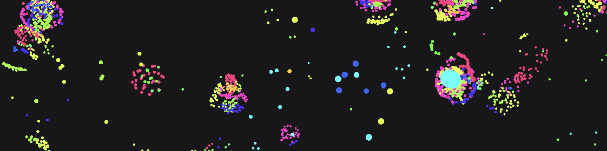

`Software Engineer focused on simulation and other real-time systems.`

I'm passionate about artificial life simulations and designing software that makes creating and running those simulations possible.\
I strongly believe in robust software architecture, even in the modern era of AI-assisted coding.

## More About Me
- **Portfolio:** [Under construction] <!-- Once the portfolio exists, link here. -->
- **Resume:** [Hosting under construction; available on request.] <!-- The resume will likely be hosted on the portfolio site, so its link can be updated in one place. -->
- **Professional contact:** [LinkedIn](https://www.linkedin.com/in/nainoa-faulkner-jackson/)

## Featured Projects

### [Particularity](https://github.com/Tiparium/Particularity)

**A particle-based physics simulation and playback editor.**

Particularity was initially created to design an engine for highly optimized physics and artificial life simulations on consumer-grade hardware. It targets macOS and uses Metal to leverage the GPU for massively parallel physics calculations. Since its inception, it has expanded to include playback features for complex datasets, allowing it to serve as a versatile data-visualization tool as well as a simulator.

### [Harbormaster](https://github.com/Tiparium/Harbormaster)

**A toolset to streamline and simplify project management and tracking for both people and AI agents.**

Harbormaster is a Visual Studio Code extension that serves as a central hub for task tracking, context management, and project coordination. It is intended to simplify project interaction for both people and AI agents. By storing important project context in designated locations, it enables easy handoffs between people and coding agents. It also supports window customization, allowing users to identify at a glance which project they are working on.

## Technical Focus

### Simulation and Real-Time Systems
Physics simulation, artificial life, GPU computation, and data playback.

### Developer Tools and Workflows
Tools for project context, task tracking, human/AI collaboration, and coding-agent handoffs.

### Software Architecture
Architecture-led, AI-native development with an emphasis on modular, maintainable code.

<!--
Drafting principles:
- Keep the opening short and specific.
- Use project descriptions to communicate evidence, ownership, and outcomes.
- Add only real links and meaningful visuals.
- Keep the stack limited to technologies relevant to the featured work.
-->
